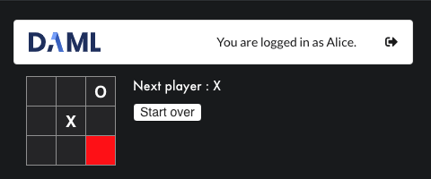

# Tic-tac-toe



[](https://docs.daml.com/getting-started/installation.html)
[](https://github.com/digital-asset/daml/blob/master/LICENSE)

This is a single-player tic-tac-toe game.

It's a bare-bones full-stack [DAML](https://daml.com/) application
that covers the following aspects:

1. A [DAML](https://docs.daml.com/index.html) model (for the game logic);
2. A UI written in [TypeScript](https://www.typescriptlang.org/).

The application relies on the DAML SDK [HTTP JSON API
service](https://docs.daml.com/json-api/index.html) feature.

The UI is developed using [React](https://reactjs.org/),
[Semantic UI](https://react.semantic-ui.com/) and its
official [React integration](https://react.semantic-ui.com/).

The project was bootstrapped from [Create DAML
App](https://github.com/hurryabit/create-daml-app).

## Getting started

Before you can run the application, you need to install the [DAML
SDK](https://docs.daml.com/getting-started/installation.html) and a
package manager for JavaScript. We are using
[yarn](https://yarnpkg.com/en/docs/install).

First, you need to obtain a copy of this project via
```bash
git clone https://github.com/shayne-fletcher-da/tic-tac-toe.git
```

Once you have copy of this project, you need to install its dependencies
by calling
```bash
yarn install
```
at the root of the repository.

### Running against a DAML sandbox ledger

1. From the tic-tac-toe repository, start the ledger.
   ```bash
   daml sandbox --max-ttl-seconds=120 --wall-clock-time --ledgerid=default-ledgerid --port 9000
   ```
2. From the tic-tac-toe repository, upload the tic-tac-toe dar.
   ```bash
   daml ledger upload-dar --host localhost --port 9000
   ```
   (Optional) To verify the dar upload, attach a navigator instance to the ledger. From the tic-tac-toe repository, start a navigator instance
   ```bash
   daml navigator server localhost 9000 --port 4000
   ```
   then, open a navigator client by pointing your browser at  http://localhost:4000.
3. From the tic-tac-toe repository directory connect a json-api to the ledger.
   ```bash
   daml json-api --ledger-host localhost --ledger-port 9000 --http-port 7575 --max-inbound-message-size 4194304 --package-reload-interval 5s --application-id HTTP-JSON-API-Gateway
   ```
4. From the tic-tac-toe repository, start the UI server.
   ```bash
   yarn start
   ```

This should open a browser window with a login screen. If it doesn't, you
can manually point your browser to http://localhost:3000.

### Running against a [Hyperledger sawtooth](https://www.hyperledger.org/projects/sawtooth) ledger

First, build and install `daml-on-sawtooth` by following that
project's
[instructions](https://github.com/blockchaintp/daml-on-sawtooth).

Then,

1. From the daml-on-sawtooth repository directory, start the ledger.
   ```bash
   docker-compose -f ./docker/compose/daml-local.yaml up
   ```
2. From the tic-tac-toe repository directory, upload the tic-tac-toe dar.
   ```bash
   daml ledger upload-dar --host localhost --port 9000
   ```
   (Optional) To verify the dar upload, attach a navigator instance to the ledger. From the tic-tac-toe repository, start a navigator instance
   ```bash
   daml navigator server localhost 9000 --port 4000
   ```
   then, open a navigator client by pointing your browser at  http://localhost:4000.
3. From the tic-tac-toe repository directory connect a json-api to the ledger.
   ```bash
   daml json-api --ledger-host localhost --ledger-port 9000 --http-port 7575 --max-inbound-message-size 4194304 --package-reload-interval 5s --application-id HTTP-JSON-API-Gateway`
   ```
4. From the tic-tac-toe repository, start the UI server.
   ```bash
   yarn start
   ```

As in the sandbox case, this should open a browser window with a login screen. If it doesn't, you
can manually point your browser to http://localhost:3000.

## A quick tour

You can log into the app by providing a user name, say `Alice`,
clicking on the calculator icon to generate an access token for the
DAML ledger, and finally clicking on "Sign up". You will then be
presented with a tic-tac-toe game to play - the rest should be
obvious!
